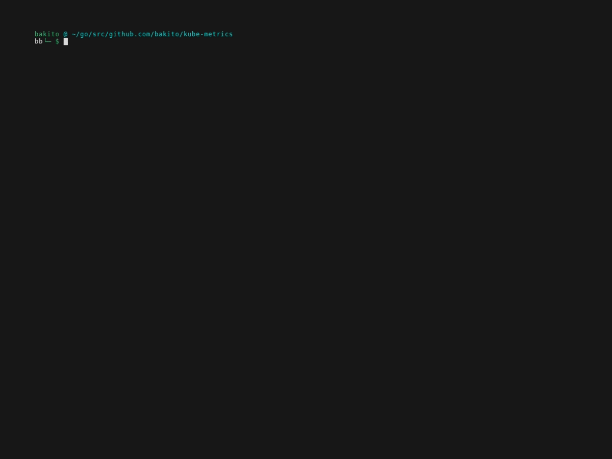

# Kube Metrics

Print pod metrics based on metrics.k8s.io/v1beta1

## Pod

```bash
kube-metrics pod <pod-name>
```

[](docs/pod.gif)

## Node

```bash
kube-metrics node <node-name>
```

[](docs/node.gif)
