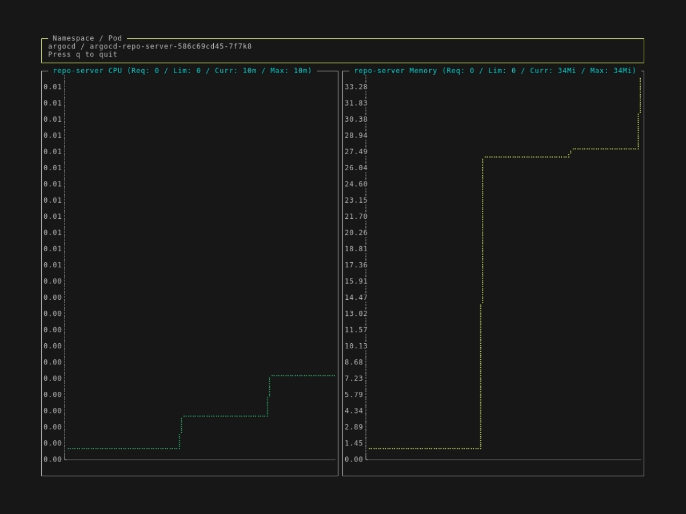
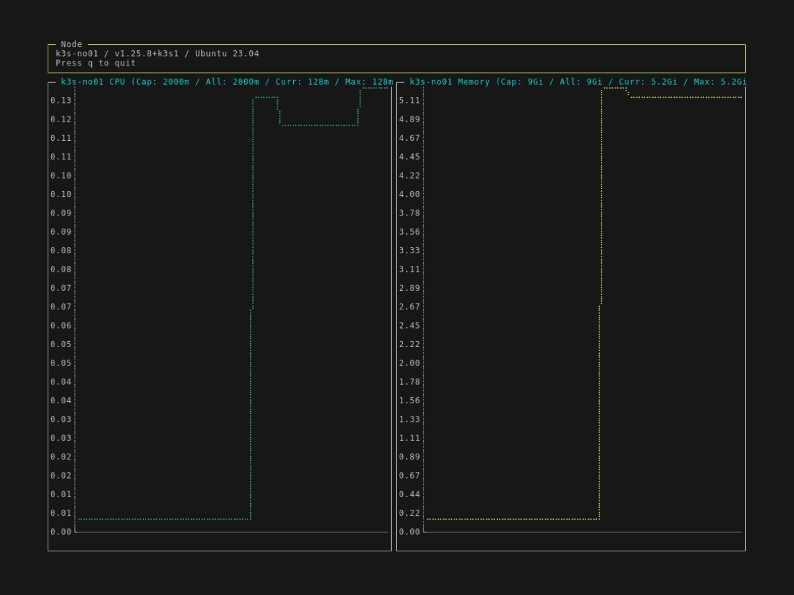

# Kube Metrics

Print pod metrics based on metrics.k8s.io/v1beta1

## Pod

```bash
kube-metrics pod <pod-name>
```

[](docs/pod.gif)

## Node

```bash
kube-metrics node <node-name>
```

[](docs/node.gif)

## Use as k9s Plugin

kube-metrics can be integrated as [k9s plugin](https://k9scli.io/topics/plugins/) with the following configuration in `$XDG_CONFIG_HOME/k9s/plugins.yaml`.

```yaml
  kube-metrics:
    shortCut: m
    confirm: false
    description: "Metrics"
    scopes:
      - pods
      - nodes
    command: sh
    background: false
    args:
      - -c
      - |
        if [ -n "$NAMESPACE" ]; then
          kube-metrics pod --namespace=$NAMESPACE $NAME
        else
          kube-metrics node $NAME
        fi
```
